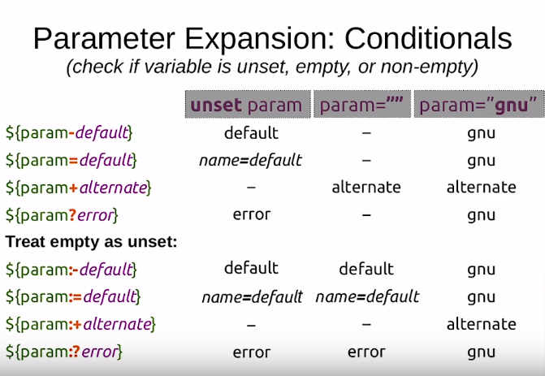

# Functions
```
#!/bin/bash
a=2
doStuff() {
	a=3
}
doStuff
echo "${a}" # echoes 3
```

# Listing the long way ls -l
```
total 20
drwxr-xr-x 4 pablo users 4096 Jan 27 21:26 autoEdit
-rw-r--r-- 1 pablo users   18 Feb 13 20:39 file_list_with_permissions.sh
drwxr-xr-x 3 pablo users 4096 Jan 27 21:26 internalEdit
-rwxr-xr-x 1 pablo users   18 Feb 13 19:21 list_processes.sh
-rw-r--r-- 1 pablo users  644 Jan 27 21:26 location.sh
```
using the first directory as an example

| symbol | meaning |
|---|---|
| d | d: directory, l: link, -: file |
| rwx | user permissions |
| r-x | group permissions |
| r-x | everyone permissions |
| 4 | number of directiories or links |
| pablo | user |
| users | group |
| 4096 | size |
| Jan 27 21:26 | date last modified |
| autoEdit | inode name |

# Login Files
* .bash\_profile is read when bash is invoked as a login shell
* .bashrc is executed for each new shell

# Redirection
```
echo '#!/bin/bash' > file.txt
# overwrites the file with #!/bin/bash

echo '#!/bin/bash' >> file.txt
# appends #!/bin/bash to the end of the file

cat file1.txt file2.txt > file3.txt
# creates file3.txt as a combination of the first two

list1 < file
# feed file to list as input
```

# Testing Expressions
* [expression] the old way
* [[expression]] the new way

| test | meaning |
|---|---|
| [[-n string]] | string is non empty |
| [[-z string]] | string is empty |
| [[string1 == string2]] | the strings are equal |
| [[string1 != string2]] | the strings are not equal |
| [[string =~ regex]] | the string matches regular expression |
| [[-e file]] | file exists |
| [[-f file]] | file is a regular file |
| [[-d file]] | file is a directory |
| [[-t fd]] | fd is open and refers to a terminal |

# Pattern Matching
* \* is any string including null
* \? is any single character
* [x-z] matches any character from x to z

# Parameter Expansion

