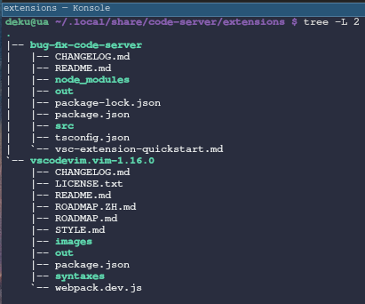
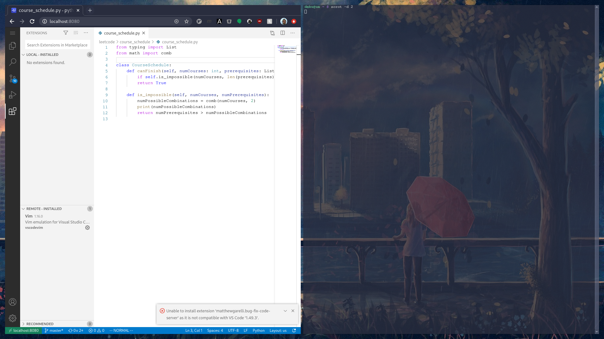
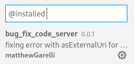
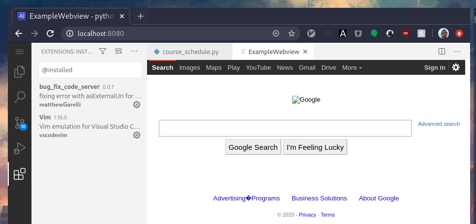

# Getting set up
Hello, so I saw [this job posting](https://www.linkedin.com/jobs/view/2186086144/?refId=ae5bac44-a176-4491-b282-f0b9b31bb87c) and took a look at the [website](https://coder.com/). I'm a little more interested in the Golang projects but thought I might take a look at the code base.

Cloned the repo and took a look at the contribution guide. Had a bit of trouble fully understanding the pull requests section. I interpreted as branch off from master and target release branch (3.5 in this case) as the destination of the PR; would ask for clarification on this.

Pulled the dependencies (can't believe vscode still uses python2 tsk tsk), my node version was too high, so I grabbed nvm.  

Then I ran into this:
```
[Error: ENOENT: no such file or directory, open '/home/****/Projects/code-server/lib/vscode/out/vs/server/entry.js'] {
  errno: -2,
  code: 'ENOENT',
  syscall: 'open',
  path: '/home/****/Projects/code-server/lib/vscode/out/vs/server/entry.js',
  phase: 'loading',
  moduleId: 'vs/server/entry',
  neededBy: [ '===anonymous1===' ]
}
```
not sure what spawns this. at first I saw it's in the submodule, so I ran ```rm -rf ./lib/vscode; yarn vscode```

however seems after waiting a bit the server just works, looks like vscode in a browser, very cool.

# Taking a look at some bugs
- first searched for ```good first issue``` to no avail
- next tried to reproduce [this bug](https://github.com/cdr/code-server/issues/2161) 
	- no dice on linux with chromium and firefox
	- could dust off the mac, but first let's see what else there is
- was having luck with ```needs investigation``` tag so jumped to [this bug](https://github.com/cdr/code-server/issues/1936)
	- from the start I'm thinking about the line:
	```Creating custom VS Code extensions and debugging them doesn't work```
	from the contributor's guide.
	- It's possible that extensions cannot be tested and run in code-server (maybe this belongs in the readme as well?)
	- seems [asExternalUri](https://github.com/microsoft/vscode/issues/81677) is part of the vscode api that extensions can use. so this one requires writing your own vscode extension, I've never done that before
	- so here we are on the vscode [extension hello world page](https://code.visualstudio.com/api/get-started/your-first-extension)
	- and now I have [my simple extension](https://github.com/mrgarelli/bug-fix-code-server) which makes a get request to googles homepage and display's that in a webview in a vscode editor tab
	- I doubt opening the extension directory and pressing F5 will work to run the extension, so now we have to figure out where [code-server stores it's extensions](https://github.com/cdr/code-server/blob/v3.5.0/doc/FAQ.md#where-are-extensions-stored) but that directory doesn't exist so I install my [all time favorite extension](https://github.com/VSCodeVim/Vim) and boom the directory is there
	
	- Unfortunately dropping the extension in the directory did not work so I did some reading on [how to pachage an extension](https://medium.com/@sanik.bajracharya/vscode-how-to-create-your-own-extension-pack-483385644c29) and generated a ```.vsix```. was able to install from file on my local code-insiders so worth a shot to try this in code-server.
	- Got an error here from a version mismatch (which is annoying because the extension would only install on code-insiders to begin with); anyway it's possible I just needed to downgrade the vscode version in ```package.json``` from the start so trying that
	
	- After updating the version in the ```package.json``` & rebuilding/deploying the vscx, code-server takes the extension!
	
	- I have to admit, at this point I'm getting pretty excited to test this, because if this works, then I don't see why one couldn't embed a matplotlib image in some html and serve it locally for code-server to consume... and It works!:
	
	- so to conclude, I don't think this is actually anything wrong with code-server, and the user could use this snippit [here](https://github.com/mrgarelli/bug-fix-code-server/blob/master/src/extension.ts#L26) to accomplish his plot rendering. seems a lot better than ```asExternalUri()``` to begin with as can do everything within code-server without needing an extra browser.

# Proposition
- So I guess neither of these were really complicated issues, but my intent was to show some thought process and maybe inspire confidence that within a few weeks I could be regularly contributing. 
- Please reach out if you think I could be a fit for the position. Would love to learn more about the team and the day to day. 
